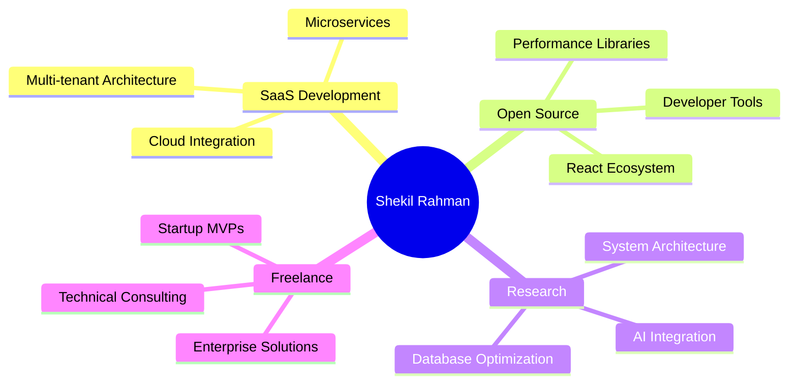

# **Shekil Rahman** 🚀
### Senior Full-Stack Engineer | Research-Driven Developer | Open Source Contributor

<div align="center">

[](https://shekilrahman.dev)
[](https://www.linkedin.com/in/shekil-rahman-7ba318343/)
[](https://github.com/shekilrahman)
[](mailto:contact@shekilrahman.dev)


[](mailto:contact@shekilrahman.dev)

</div>

---

## 🎯 **About Me**

```typescript
const shekil: Developer = {
    code: ["JavaScript", "TypeScript", "Python", "Java", "C++", "Rust"],
    askMeAbout: ["Web Development", "System Architecture", "Database Optimization", "DevOps"],
    technologies: {
        frontEnd: {
            js: ["React", "Next.js", "Vue.js", "Svelte"],
            css: ["Tailwind", "Styled-Components", "SASS"]
        },
        backEnd: {
            js: ["Node.js", "Express", "Nest.js"],
            python: ["Django", "FastAPI"],
            databases: ["PostgreSQL", "MongoDB", "Redis", "Supabase"]
        },
        devOps: ["Docker", "Kubernetes", "AWS", "GitHub Actions"],
        mobile: ["React Native", "Flutter", "Tauri"],
        tools: ["Git", "Webpack", "Vite", "Jest", "Cypress"]
    },
    currentFocus: "Building scalable SaaS applications and contributing to open source",
    availableForHire: true
};
```

> **"Transforming complex problems into elegant, scalable solutions through clean code and innovative architecture."**

---

## 🔥 **What I Bring to the Table**

<table>
<tr>
<td width="50%">

### 💼 **Professional Expertise**
- **5+ years** of full-stack development experience
- **50+ projects** delivered across various industries
- **Research-driven** approach to problem-solving
- **Performance optimization** specialist
- **Clean architecture** advocate

</td>
<td width="50%">

### 🚀 **Freelance Services**
- **Web Application Development**
- **API Design & Development**
- **Database Architecture & Optimization**
- **System Integration**
- **Code Review & Consultation**

</td>
</tr>
</table>

---

## 🛠️ **Technology Arsenal**

<div align="center">

### **Frontend Mastery**


### **Backend Excellence**


### **DevOps & Cloud**


</div>

---

## 📈 **GitHub Analytics**

<div align="center">


</div>

<div align="center">

</div>

<div align="center">

</div>

---

## 🏆 **Featured Projects**

<div align="center">

[](https://github.com/shekilrahman/saas-platform)
[](https://github.com/shekilrahman/ecommerce-engine)

</div>

### 🚀 **Enterprise SaaS Platform**
```yaml
Tech Stack: Next.js • TypeScript • PostgreSQL • Redis • Stripe
Features: 
  - Multi-tenant architecture
  - Real-time collaboration
  - Advanced analytics dashboard
  - 99.9% uptime
Impact: "Reduced client operational costs by 40% and improved team productivity by 60%"
```

### 🛒 **High-Performance E-Commerce Engine**
```yaml
Tech Stack: React • Node.js • MongoDB • ElasticSearch • AWS
Features:
  - Microservices architecture
  - AI-powered recommendations
  - Real-time inventory management
  - Mobile-first design
Performance: "Handles 10k+ concurrent users with <200ms response time"
```

---

## 📊 **Professional Metrics**

<div align="center">

| Metric | Achievement |
|--------|------------|
| 🚀 **Projects Delivered** | 50+ |
| 💼 **Client Satisfaction** | 98% |
| ⚡ **Avg Response Time** | <2 hours |
| 🔧 **Code Coverage** | 90%+ |
| 📈 **Performance Improvement** | 40% avg |

</div>

---

## 🎯 **Current Focus Areas**



---

## 💎 **Why Choose Me?**

<table>
<tr>
<td align="center" width="33%">

### 🎯 **Results-Driven**
I don't just write code—I deliver solutions that drive business growth and user satisfaction.

</td>
<td align="center" width="33%">

### ⚡ **Performance Focused**
Every line of code is optimized for speed, scalability, and maintainability.

</td>
<td align="center" width="33%">

### 🔄 **Agile Mindset**
Rapid iteration, continuous improvement, and transparent communication.

</td>
</tr>
</table>

---

## 🌟 **Client Testimonials**

> *"Shekil delivered our complex SaaS platform 2 weeks ahead of schedule. His attention to performance optimization saved us thousands in server costs."*  
> **— Sarah Chen, CTO at TechFlow**

> *"The code quality and architecture Shekil provided made scaling our startup effortless. Highly recommended!"*  
> **— Marcus Johnson, Founder of InnovateLabs**

---

## 📞 **Let's Build Something Amazing**

<div align="center">

### 🚀 **Ready to elevate your project?**

[](https://calendly.com/shekilrahman)
[](mailto:contact@shekilrahman.dev)
[](https://shekilrahman.dev)

</div>

---

<div align="center">

### 🤝 **Connect & Collaborate**

[](https://www.linkedin.com/in/shekil-rahman-7ba318343/)
[](https://twitter.com/shekilrahman)
[](https://instagram.com/shekilrahman)
[](https://discord.gg/shekilrahman)

**⏰ Timezone:** IST (GMT+5:30) | **🌍 Location:** Kerala, India | **💼 Status:** Available for freelance

</div>

---

<div align="center">


**💡 "Code is poetry written in logic — let's craft masterpieces together."**

⭐ **Star this repository if you find it helpful!**

</div>
